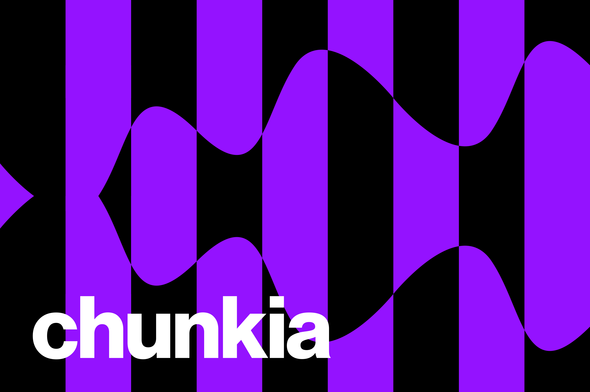
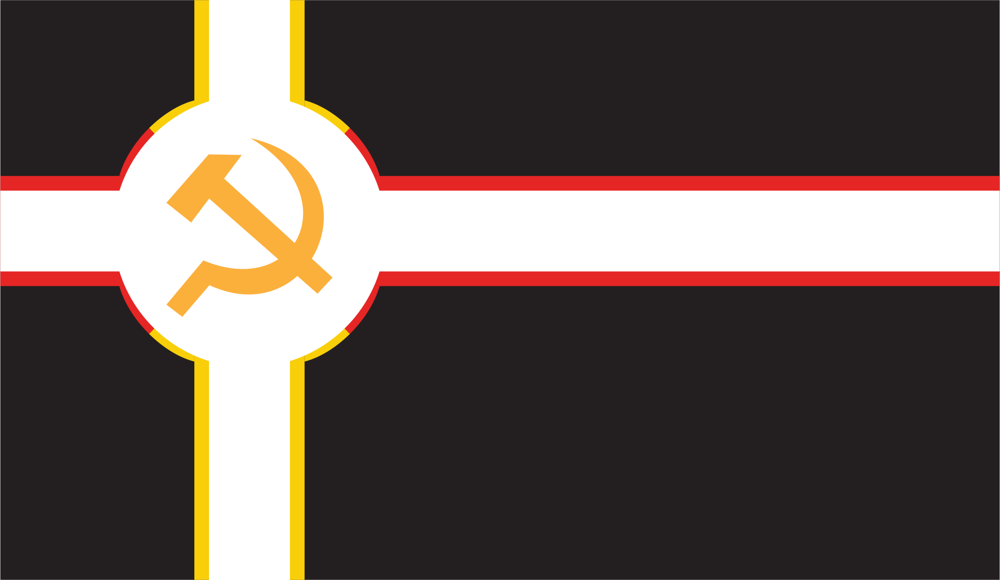
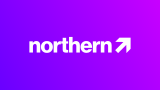

# Clyde's Real Survival SMP

## Server Rules

rules coming soon
listen to the admins

## Nations

### Republic of Panorama

- President: WorldWidePixel
- **Laws: [(Link to document)](./Nations/Republic%20of%20Panorama/Laws.md).**
- Flag:  [(Link to image)](./Nations/Republic%20of%20Panorama/Flag.svg)
- Land Size: not yet calculated™
- Map: coming soon™

### Chunkia

- Prime Minister: WorldWidePixel
- **Laws: Listen to WorldWidePixel, please.**
- Flag:  [(Link to image)](./Nations/Chunkia/chunkia512.png)
- Land Size: not yet calculated™
- Map: later™

### Toasteria

- Established Chancellor: Lupancham
- **Laws: [(Over Here)](./Nations/Toasteria/Laws.md).**
- Flag:  [(Link to image)](./Nations/Toasteria/toasteriaflag.svg)
- Land Size: not yet calculated™
- Map: coming soon™

### Republic of Budapest

- Prime Minister: TheClashFruit
- Languages: Hungarian, English, German
- Laws: [(Link to document)](./Nations/Republic%20of%20Budapest/Laws.md).
- Flag:  [(Link to image)](./Nations/Republic%20of%20Budapest/Assets/Flag.svg)
- Land Size: not yet calculated™
- Map: coming soon™

### Romanian Federation of Minecraft

- President: polycord
- Languages: Romanian, English
- Laws: not there yet, just listen to polycord
- Flag:  [(Link to image)](./Nations/Romanian%20Federation%20of%20Minecraft/FMC%20flag.svg)
- Land size: not calculated™
- Map: coming soon™

## Companies

### Blurbank

- Type: Bank
- Description: "Blurbank is the first and greatest bank of the CRSS world. With high quality banking services, and high security vaults, you can trust Blurbank with your diamonds more than you can trust Ender Chests."
- Origin: Republic of Panorama
- Locations: ROP, RFM
- Owner(s): Blurryface
- Subsidiaries: None
- Icon:  [(Link to image)](./Companies/Republic%20of%20Panorama/Blurbank/Blurbank%20Icon.svg)
- Worth: Not yet calculated™
- Locations on map: [ROP](https://crss.cc/), [ROP (2)](https://crss.cc), [RFM](https://crss.cc)

### Quartz Industries Inc.

- Type: TBA
- Description: "Quartz Industries is a company based in ROP committed to improving the quality of life and provide many services to the people of Panorama."
- Origin: Republic of Panorama
- Locations: ROP
- Owner(s): Blurryface, WorldWidePixel
- Subsidiaries: Quartz Media LLC
- Icon:  [(Link to image)](./Companies/Republic%20of%20Panorama/Quartz%20Industries/QiIckn.svg)
- Worth: Not yet calculated™
- Locations on map: [ROP](https://crss.cc/)

### Northern

- Type: Housing and Commercial Office Building
- Description: "Northern is a company coming from Chubkia to improve the quality of life of Panorama's housing and commercial offices. With 6 (4 NA, 2 NB) buildings, we are the right choice for any kind of house or business."
- Origin: Chunkia
- Locations: ROP
- Owner(s): WorldWidePixel
- Subsidiaries: None
- Icon:  [(Link to image)](./Companies/Chunkia/Northern/northern.svg)
- Worth: Not yet calculated™
- Locations on map: [ROP](https://crss.cc/), [ROP 2](https://crss.cc/), [ROP 3](https://crss.cc/), [ROP 4](https://crss.cc/), [ROP 5](https://crss.cc/), [ROP 6](https://crss.cc/), 

### XYZ Media LLC

- Type: Media
- Description: "XYZ Media is the truly free Media company of ROP. We are committed to only show the truth, free of any kind of State Propaganda."
- Origin: Republic of Panorama
- Locations: ROP
- Owner(s): Sake, Lupancham
- Subsidiaries: None
- Icon:  [(Link to image)](./Companies/Republic%20of%20Panorama/XYZ%20Media/xyzicon.svg)
- Worth: Not yet calculated™
- Locations on map: [ROP](https://crss.cc/)

### ROP Casino

- Type: Entertainment
- Description: "The ROP Cadino is the #1 place to entertain yourself. Try our games and have the chance to win big and come out swimming in diamonds!"
- Origin: Republic of Panorama
- Locations: ROP
- Owner(s): Blurryface
- Subsidiaries: None
- Icon:  [(Link to image)](./Companies/Republic%20of%20Panorama/Casino/CasinoIcon.svg)
- Worth: Not yet calculated™
- Locations on map: [ROP](https://crss.cc/)

### Charge Industries

- Type: TBA
- Description: "TBA"
- Origin: Toasteria
- Locations: TOA
- Owner(s): Lupancham
- Subsidiaries: None
- Icon:  [(Link to image)](./Companies/Toasteria/Charge%20Industries/ChargeIcon.svg)
- Worth: Not yet calculated™
- Locations on map: [TOA](https://crss.cc/)

### RUN

- Type: Multi-nation Organization
- Description: "The Real United Nations (RUN) is an organization composed of all the main nations in the world. Conflicts and collaborations between nations shall be settled here."
- Origin: Global
- Locations: CHK
- Owner(s): Chunkia, Republic of Panorama, Republic of Budapest, Romanian Federation of Minecraft, Toasteria
- Subsidiaries: None
- Icon:  [(Link to image)](./Companies/Global/RUN/RunIcon.svg)
- Worth: N/A
- Locations on map: [CHK](https://crss.cc/)

### Toasteria National Bank

- Type: Bank
- Description: "Toasteria National Bank (TNB) is the greatest bank of the CRSS world. With high quality banking services, and high security vaults, you can trust TNB with your diamonds more than you can trust Ender Chests."
- Origin: Toasteria
- Locations: TOA
- Owner(s): Lupancham
- Subsidiaries: None
- Icon:  [(Link to image)](./Companies/Toasteria/Toasteria%20National%20Bank/TNBIcon.svg)
- Worth: Not yet calculated™
- Locations on map: [TOA](https://crss.cc/)

### Gay Co.

- Type: Audio Media Publishing, Distributing and Studio
- Description: "Gay Co. is the first and greatest Audio Media company of the whole world. You will find your favorite artists here, and you can become one too!"
- Origin: Republic of Panorama
- Locations: ROP
- Owner(s): Blurryface
- Subsidiaries: None
- Icon:  [(Link to image)](./Companies/Republic%20of%20Panorana/Gay%20Co/GayIcon.svg)
- Worth: Not yet calculated™
- Locations on map: [ROP](https://crss.cc/)

### ROP Postal Office

- Type: Post Office
- Description: "The #1 solution for mail in ROP"
- Origin: Republic of Panorama
- Locations: ROP
- Owner(s): The ROP Government
- Subsidiaries: None
- Icon:  [(Link to image)](./Companies/Republic%20of%20Panorama/Post%20Officr/POIcon.svg)
- Worth: Not yet calculated™
- Locations on map: [ROP](https://crss.cc/)

### Deforest Corp

- Type: Terraforming
- Description: "Deforest Corp. is the #1 Deforestation Service in the whole world! What do you mean it's not something to be proud of? We only do it when it's needed for construction, it's just that there's no other company that focuses on this"
- Origin: Romanian Federation of Minecraft
- Locations: RFM
- Owner(s): polycord
- Subsidiaries: None
- Icon:  [(Link to image)](./Companies/Romanian%20Federation%20%of%20Minecraft/Deforest/DeforestIcon.svg)
- Worth: Not yet calculated™
- Locations on map: [RFM](https://crss.cc)

### Quartz Media LLC

- Type: TBA
- Description: "TBA"
- Origin: Toasteria
- Locations: TOA
- Owner(s): Lupancham
- Owner(s): Quartz Industries Inc.
- Icon:  [(Link to image)](./Companies/Toasteria/Charge%20Industries/ChargeIcon.svg)
- Worth: Not yet calculated™
- Locations on map: [ROP](https://crss.cc/)

<!-- ### Public Browser Map

The server also has a [(Public Map!)](http://141.147.29.5:25582/#crss;flat;64,64,-60;0) -->

## ♥ Our sponsors

- TCFRHC LLC.
- LRHC LLC.
- [Pridecraft Studios](https://pridecraft.gay).
- [Badger](https://badger.worldwidepixel.ca).
- [NotEssential](https://notessential.blurry.gay).
