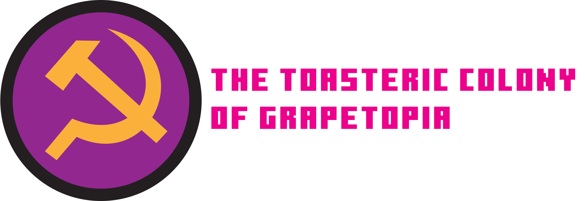
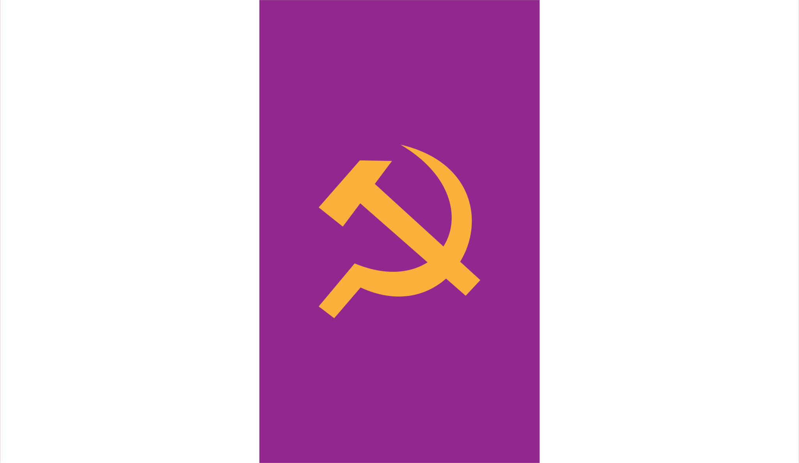

# Clyde's Real Survival SMP
## Server Rules
1. The use of modified clients that give an unfair advantage to players, such as hacked clients, is not permitted.

- You are not allowed to use them even for their legitimate features, such as a fullbright option

- If admins suspect you are hacking you will be immediately banned

2. Do not modify or destroy (grief) other player's constructions without their consent, or steal any of their items

- You are allowed to visit any build, as long as you don't take anything, and if you do you pay them back

- You should ask permission in the discord or the in-game chat before modifying builds

3. Follow the laws of the nations you are in to avoid issues with other players and making the server unfun to play

- If you feel the laws are too vague, feel free to ask the people in charge of them what they meanr with something, and feel free to contribute to them. Complaining that they don't make sense won't get you anywhere

<!--thanks echo -->

- Breaking laws isn't bannable, the nation you are in will take measures and punish you for your actions as they see fit.

4. Do not attempt to make nations where the territory is already owned by another nation

- You can make it near the borders of a nation but never inside one, you can't just take existing territory as your own.

- Other nations are free to claim more territory whenever they feel like it, as long as it doesnt take other nations' territory with it

<!--No, you can't make your house a nation if it was inside psf borders. -->

<!-- ## Server Rules:
1. The usage of modified clients that gives unfair advantage to players is not permitted. **TL;DR Do not cheat.**
2. Do not modify (or destroy) other players' constructions, or take their items, without their permission. **TL;DR Do not grief or steal.**

**Failing to follow these basic rules will result in a ban.** -->

## Nations:

### Panorama Socialist Federation
 <!-- this needs to be updated moyai -->

- Prime Minister: Sake (aka iforgotaname)
- **Laws: [(Link to document)](./Nations/Republic%20of%20Panorama/Laws.md).**
- Flag:  [(Link to image)](./Nations/Republic%20of%20Panorama/Flag.svg)
- Land Size: not yet calculated™
- Map: soon™

<!-- ### Democratic Republic of Rayland

- President: NormalFery
- **Laws: [(Over Here)](./Nations/Democratic%20Republic%20of%20Rayland/Laws.md).**
- Flag:  [(Link to image)](./Nations/Democratic%20Republic%20of%20Rayland/DRR_temp_flag.png)
- Land Size: not yet calculated™
- Map: soon™ -->

### Chunkia

- Prime Minister: WorldWidePixel
- **Laws: Listen to WorldWidePixel, please.**
- Flag:  [(Link to image)](./Nations/Chunkia/chunkia512.png)
- Land Size: not yet calculated™
- Map: later™ 

### Toasteria

- Established Chancellor: Lupancham
- **Laws: [(Over Here)](./Nations/Toasteria/Laws.md).**
- Flag:  [(Link to image)](./Nations/Toasteria/toasteriaflag.svg)
- Land Size: not yet calculated™
- Map: [(-573; -5123)](https://crss.blurryface.xyz/map?center=-573;-5123) 

### Republic of Budapest

- Prime Minister: TheClashFruit
- Languages: Hungarian, English, German
- Laws: [(Link to document)](./Nations/Republic%20of%20Budapest/Laws.md).
- Flag:  [(Link to image)](./Nations/Republic%20of%20Budapest/Assets/Flag.svg)
- Land Size: not yet calculated™
- Map: [(-2144; -320)](https://crss.blurryface.xyz/map?center=-2144.5;-320.5)

### Romanian Federation of Minecraft

- President: polycord aka bluaxol
- Languages: Romanian, English
- Laws: not there yet, just listen to polycord
- Flag:  [(Link to image)](./Nations/Romanian%20Federation%20of%20Minecraft/FMC%20flag.svg)
- Land size: not calculated™
- Map: coming soon™

### The Toasteric Colony of Grapetopia

- Leader In Charge: MrLagSwitcha
- Laws: ***Soon™***.
- Flag:  [(Link to image)](./Nations/Grapetopia/TCG.svg)
- Land ≈384m²
- Map: [(-7589; -2878)](https://crss.blurryface.xyz/map?center=-7589;2878)

<!-- ### Public Browser Map

The server also has a [(Public Map!)](http://141.147.29.5:25582/#crss;flat;64,64,-60;0) -->

## ♥ Our sponsors:
- TCFRHC LLC.
- [Pridecraft Studios](https://pridecraft.gay).