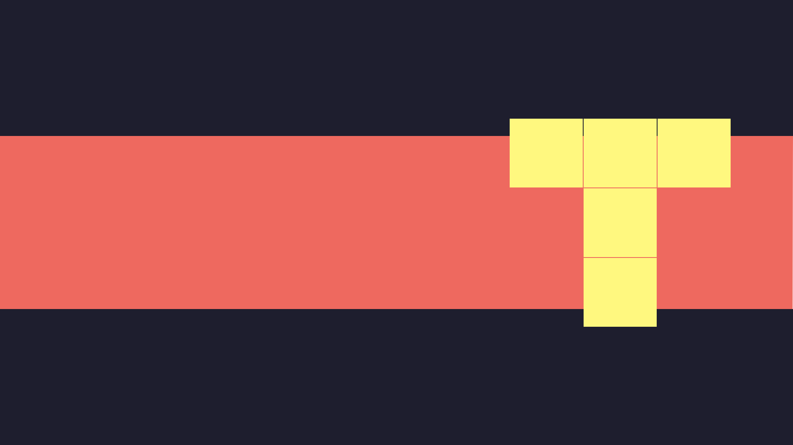

# CRSS

Welcome to Clyde's Real Survival SMP (CRSS)!

## Information

This is CRSS, a server created by [Blurry](https://blurry.gay). The server's twist is that it started on [b1.0](https://minecraft.wiki/w/b1.0) and updated all the way to [1.21.8](https://minecraft.wiki/w/1.21.8) on the start of each month, or more recently, when new versions get supported by the server-side mods we use.

We've been doing this for a good while, and our server has many structures and has had many players.

It currently has 3 main nations, ROP, TOA and CHK, each one with unique styles and terrain.

We have an [Youtube channel](https://yt.crss.cc) where we post content from our server. You can subscribe to it to stay tuned with CRSS content and new episodes of Quartz News Network.

The seed used in the world is the same seed the first Main Menu Panorama used, and a pack with a panorama from the area which we built over, on the original coordinates.

## Rules

1. The use of modified clients that give an unfair advantage to players, such as hacked clients, is not permitted.
    - You are not allowed to use them even for their legitimate features, such as a "fullbright" option.
    - If admins suspect you are hacking you will be immediately banned.
2. Do not modify or destroy (grief) other player's constructions without their consent, or steal any of their items.
    - You are allowed to visit any build, as long as you don't take anything, and if you do you pay them back.
    - You should ask permission in the discord or the in-game chat before modifying builds.
3. Follow the laws of the nations you are in to avoid issues with other players and making the server not fun to play.
    - If you feel the laws are too vague, feel free to ask the people in charge of them what they mean with something, and feel free to contribute to them. Complaining that they don't make sense won't get you anywhere.
    - Breaking laws won't necessarily get you banned, the nation you are in will take measures and punish you for your actions as they see fit.
4. Do not attempt to make nations where the territory is already owned by another nation.
You can make it near the borders of a nation but never inside one, you can't just take existing territory as your own.
    - Other nations are free to claim more territory whenever they feel like it, as long as it doesn't take other nations' territory with it.

***Failing to follow these rules may result in a ban.***

## Nations

<!-- ↓↓↓ template ↓↓↓ 

### Goose Amphitheatre Yogurt

- President: Steve
- **Laws: [(Link to document)]().**
- Flag:  [(Link to image)](./Nations/Goose%20Amphitheatre%20Yogurt/Flag.svg)
- Land Size: not yet calculated™
- Map: coming soon™

↑↑↑ template ↑↑↑ -->

### Directly Incredible Kilometer

- President: NormalFery (Fery)
- **Laws: soon™**
- Flag:  [(Link to image)](./Nations/directly-incredible-kilometer/dik-flag.png)
- Land Size: not yet calculated™
- Map: coming soon™

## Companies

### GREAT

- Type: Transport
- Description: "Providing convenient transportation to all."
- Origin: unknowm
- Locations: UNK
- Owner(s): Blurryface
- Icon:  [(Link to image)](./Companies/missing/GTEAT/GREATicon.svg)
- Worth: Not Yet Calculated™

### Quartz Media LLC

- Type: Audiovisual Media Producer
  - Studios:
    - Quartz Studios (ROP, CRSS)
    - Oak Studios (   , CRSS 3)
    - Golden Studios (Strudel, Craftocracy)
- Description: "Panorama's greatest audiovisual media producer, creators of Quartz News Network"
- Origin: Republic of Panorama
- Locations: ROP,    , Strudel
- Owner(s): Quartz Industries Inc.
- Icon:  [(Link to image)](./Companies/Republic%20of%20Panorama/Quartz%Industries/Quartz%Media/QuartzMediaIcon.svg)
- Worth: Not yet calculated™

<!-- ### Public Browser Map

The server also has a [(Public Map!)](http://141.147.29.5:25582/#crss;flat;64,64,-60;0) -->

## ♥ Our sponsors

- TCFRHC LLC.
- Craftocracy
- Quartz Media
- The Northern Party
- [Pridecraft Studios](https://pridecraft.gay).
- [Badger](https://badger.worldwidepixel.ca).

*Note: Sponsors in CRSS are RP-only and have no monetary or contractual relations with CRSS.*

**© 2023 - 2025 CRSS**
