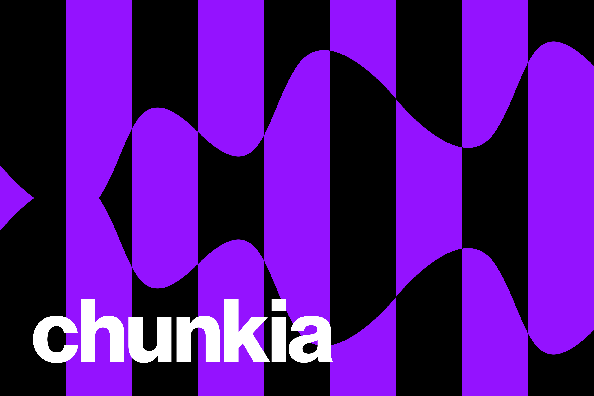
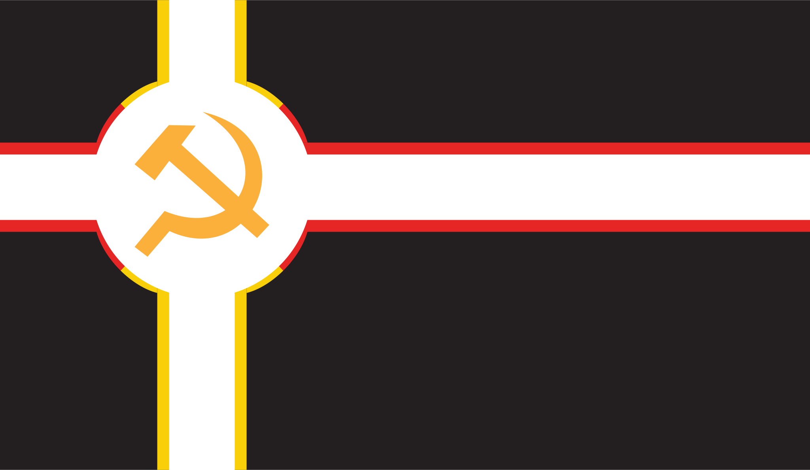
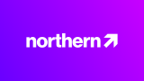

# CRSS

Welcome to Clyde's Real Survival SMP (CRSS)!

# Server-specific Information

This is CRSS, a server created by [Blurry](https://blurry.gay). The server's twist is that it started on [b1.0](https://minecraft.wiki/w/b1.0) and updated all the way to [1.21.11](https://minecraft.wiki/w/1.21.11) on the start of each month, or more recently, when new versions get supported by the server-side mods we use.

We've been doing this for a good while, and our server has many structures and has had many players.

It currently has 3 main nations, ROP, TOA and CHK, each one with unique styles and terrain.

We have an [Youtube channel](https://yt.crss.cc) where we post content from our server. You can subscribe to it to stay tuned with CRSS content and new episodes of Quartz News Network.

The seed used in the world is the same seed the first Main Menu Panorama used.

# Rules

Here are the main rules that are applicable to everything CRSS:

1. Don't be a dick.
    - Repeatedly sending some phrase or word with the intention to piss someone off is not okay at all. We want everybody's stay to be enjoyable.
    - For example, stating you're currently experiencing natural phenomena that's often taken as disrespectful towards people around you, is considered being a dick.
    - Griefing, insulting for no reason, and giving non constructive critiques will be considered as being a dick.
    - We're including things such as homophobia, transphobia, political extremism, and religious extremism as being a dick.

2. Don't hack.
    - This should go without saying, any use of a modified client with the intention of gaining an unfair advantage over other players is banned.
    - Tools such as litematica, minihud, or whatever y'all use to make farms these days are still allowed.

3. Don't import drama
    - External drama isn't welcome here. Keep that to your DMs or /tells, we don't want to turn this place into a drama museum.
    - If you're a community manager from some other community and would like to inform us of serious information about a certain user or group, DM @blryface_ and they'll help you out.

4. No explicit sexual content or topics.
    - This is not an e-dating server, even though we have marriages and such. We do not want to know about what you want to do with yourself or someone else in here, and we will take immediate action.
    - Silly jokes like 'hehe 69 lol funny number', naming a nation Directly Incredible Kilometer just so it shortens as `DIK`, and making upside down T's in game are alright. We don't care, as long as you're not gross about it.

5. **Respect everyone's privacy.**
    - I should not have to say this, but obviously don't expose private message and information about people in here.
    - No doxing, no identity exposure, no taking anyone out the closet, **__respect their privacy.__**
    - We will ban you immediately and permanently if you fail to follow this.

6. Remember to have fun!
    - owo meow mrrp :3

# Information

Here's general information for everything CRSS!

## CRSS (Main Server)

- Location
    - Europe
- IPs:
    - `play.crss.cc`
    - `play.crssi.cc`
    - `crss.cc`
    - `crssi.cc`
- Version:
    - 1.21.8
- Age
    - ~2.8 Years Old

## CRSS 3 (Beta Server)

- Location
    - Europe
- IPs:
    - `play.crss.cc:26069`
    - `play.crssi.cc:26069`
    - `crss.cc:26069`
    - `crssi.cc:26069`
- Version:
    - b1.7 - b1.7.3
- Age
    - ~6 Months Old

## FAQ

- How do I start a nation?
    - Add information about it on [our GitHub](<https://github.com/crss666/crss>) and/or [our Wiki](<https://wiki.crss.cc>)! The Community Managers can help you put it up correctly. Since our wiki doesn't accept SVGs yet, you can keep the SVG versions of your flag and banner on the GitHub instead.
- Do I need to engage in the geopolitics roleplay?
    - No! You're free to do what you want. But, if you do engage in the roleplay, and only seem to say you're out to benefit yourself, people will not like you a lot... so try not doing that :p
- I need help! Something went out of control, I died somewhere that's impossible to get my items back, or another player is annoying everyone!
    - Don't hesitate to ping us. We will try to help you achieve what you need, as long as it isn't in the "give me 67 diamonds pls :3" sense.
- I want to suggest something! I want more information on X!
    - Ping @blryface_ on Discord. They'll tell you to ping *other people* if its out of their control.

## Final notes

We aim to be a friendly and nice place to stay at! Remember to have fun. If you make people not want to play, we're gonna make you be unable to play :3c /silly /srs

# Nations

### Republic of Panorama

- President: WorldWidePixel
- **Laws: [(Link to document)](./Nations/Republic%20of%20Panorama/Laws.md).**
- Flag:  [(Link to image)](./Nations/Republic%20of%20Panorama/Flag.svg)
- Website: https://rop.crssi.cc
- Land Size: not yet calculated™
- Map: coming soon™

### Chunkia

- Prime Minister: WorldWidePixel
- **Laws: Listen to WorldWidePixel, please.**
- Flag:  [(Link to image)](./Nations/Chunkia/chunkia512.png)
- Website: https://chk.crssi.cc
- Land Size: not yet calculated™
- Map: later™

### Toasteria

- Established Chancellor: Lupancham
- **Laws: [(Over Here)](./Nations/Toasteria/Laws.md).**
- Flag:  [(Link to image)](./Nations/Toasteria/toasteriaflag.svg)
- Website: https://toa.crssi.cc
- Land Size: not yet calculated™
- Map: coming soon™

### Republic of Budapest

- Prime Minister: TheClashFruit
- Languages: Hungarian, English, German
- Laws: [(Link to document)](./Nations/Republic%20of%20Budapest/Laws.md).
- Flag:  [(Link to image)](./Nations/Republic%20of%20Budapest/Assets/Flag.svg)
- Website: https://rob.crssi.cc
- Land Size: not yet calculated™
- Map: coming soon™

# Companies

### Blurbank

- Type: Bank
- Description: "Blurbank is the first and greatest bank of the CRSS world. With high quality banking services, and high security vaults, you can trust Blurbank with your diamonds more than you can trust Ender Chests."
- Origin: Republic of Panorama
- Locations: ROP, RFM
- Owner(s): Blurryface
- Subsidiaries: None
- Icon:  [(Link to image)](./Companies/Republic%20of%20Panorama/Blurbank/Blurbank%20Icon.svg)
- Worth: Not yet calculated™
- Locations on map: [ROP](https://crss.cc/), [ROP (2)](https://crss.cc), [RFM](https://crss.cc)

### Quartz Industries Inc.

- Type: TBA
- Description: "Quartz Industries is a company based in ROP committed to improving the quality of life and provide many services to the people of Panorama."
- Origin: Republic of Panorama
- Locations: ROP
- Owner(s): Blurryface, WorldWidePixel
- Subsidiaries: Quartz Media LLC
- Icon:  [(Link to image)](./Companies/Republic%20of%20Panorama/Quartz%20Industries/QiIckn.svg)
- Worth: Not yet calculated™
- Locations on map: [ROP](https://crss.cc/)

### Northern

- Type: Housing and Commercial Office Building
- Description: "Northern is a company coming from Chubkia to improve the quality of life of Panorama's housing and commercial offices. With 6 (4 NA, 2 NB) buildings, we are the right choice for any kind of house or business."
- Origin: Chunkia
- Locations: ROP
- Owner(s): WorldWidePixel
- Subsidiaries: None
- Icon:  [(Link to image)](./Companies/Chunkia/Northern/northern.svg)
- Worth: Not yet calculated™
- Locations on map: [ROP](https://crss.cc/), [ROP 2](https://crss.cc/), [ROP 3](https://crss.cc/), [ROP 4](https://crss.cc/), [ROP 5](https://crss.cc/), [ROP 6](https://crss.cc/), 

### XYZ Media LLC

- Type: Media
- Description: "XYZ Media is the truly free Media company of ROP. We are committed to only show the truth, free of any kind of State Propaganda."
- Origin: Republic of Panorama
- Locations: ROP
- Owner(s): Sake, Lupancham
- Subsidiaries: None
- Icon:  [(Link to image)](./Companies/Republic%20of%20Panorama/XYZ%20Media/xyzicon.svg)
- Worth: Not yet calculated™
- Locations on map: [ROP](https://crss.cc/)

### ROP Casino

- Type: Entertainment
- Description: "The ROP Cadino is the #1 place to entertain yourself. Try our games and have the chance to win big and come out swimming in diamonds!"
- Origin: Republic of Panorama
- Locations: ROP
- Owner(s): Blurryface
- Subsidiaries: None
- Icon:  [(Link to image)](./Companies/Republic%20of%20Panorama/Casino/CasinoIcon.svg)
- Worth: Not yet calculated™
- Locations on map: [ROP](https://crss.cc/)

### Charge Industries

- Type: TBA
- Description: "TBA"
- Origin: Toasteria
- Locations: TOA
- Owner(s): Lupancham
- Subsidiaries: None
- Icon:  [(Link to image)](./Companies/Toasteria/Charge%20Industries/ChargeIcon.svg)
- Worth: Not yet calculated™
- Locations on map: [TOA](https://crss.cc/)

### RUN

- Type: Multi-nation Organization
- Description: "The Real United Nations (RUN) is an organization composed of all the main nations in the world. Conflicts and collaborations between nations shall be settled here."
- Origin: Global
- Locations: CHK
- Owner(s): Chunkia, Republic of Panorama, Republic of Budapest, Romanian Federation of Minecraft, Toasteria
- Subsidiaries: None
- Icon:  [(Link to image)](./Companies/Global/RUN/RunIcon.svg)
- Worth: N/A
- Locations on map: [CHK](https://crss.cc/)

### Toasteria National Bank

- Type: Bank
- Description: "Toasteria National Bank (TNB) is the greatest bank of the CRSS world. With high quality banking services, and high security vaults, you can trust TNB with your diamonds more than you can trust Ender Chests."
- Origin: Toasteria
- Locations: TOA
- Owner(s): Lupancham
- Subsidiaries: None
- Icon:  [(Link to image)](./Companies/Toasteria/Toasteria%20National%20Bank/TNBIcon.svg)
- Worth: Not yet calculated™
- Locations on map: [TOA](https://crss.cc/)

### Gay Co.

- Type: Audio Media Publishing, Distributing and Studio
- Description: "Gay Co. is the first and greatest Audio Media company of the whole world. You will find your favorite artists here, and you can become one too!"
- Origin: Republic of Panorama
- Locations: ROP
- Owner(s): Blurryface
- Subsidiaries: None
- Icon:  [(Link to image)](./Companies/Republic%20of%20Panorana/Gay%20Co/GayIcon.svg)
- Worth: Not yet calculated™
- Locations on map: [ROP](https://crss.cc/)

### ROP Postal Office

- Type: Post Office
- Description: "The #1 solution for mail in ROP"
- Origin: Republic of Panorama
- Locations: ROP
- Owner(s): The ROP Government
- Subsidiaries: None
- Icon:  [(Link to image)](./Companies/Republic%20of%20Panorama/Post%20Officr/POIcon.svg)
- Worth: Not yet calculated™
- Locations on map: [ROP](https://crss.cc/)

### Quartz Media LLC

- Type: Audiovisual Media Producer
  - Studios:
    - Quartz Studios (ROP, CRSS)
    - Oak Studios (   , CRSS 3)
    - Golden Studios (Strudel, Craftocracy)
- Description: "Panorama's greatest audiovisual media producer, creators of Quartz News Network"
- Origin: Republic of Panorama
- Locations: ROP,    , Strudel
- Owner(s): Quartz Industries Inc.
- Icon:  [(Link to image)](./Companies/Republic%20of%20Panorama/Quartz%Industries/Quartz%Media/QuartzMediaIcon.svh)
- Worth: Not yet calculated™
- Locations on map: [ROP](https://crss.cc/)

<!-- ### Public Browser Map

The server also has a [(Public Map!)](http://141.147.29.5:25582/#crss;flat;64,64,-60;0) -->

## ♥ Our sponsors

- TCFRHC LLC.
- Craftocracy
- Quartz Media
- The Northern Party
- [Pridecraft Studios](https://pridecraft.gay).
- [Badger](https://badger.worldwidepixel.ca).

*Note: Sponsors in CRSS are RP-only and have no monetary or contractual relations with CRSS.*

**© 2023 - 2025 CRSS**
